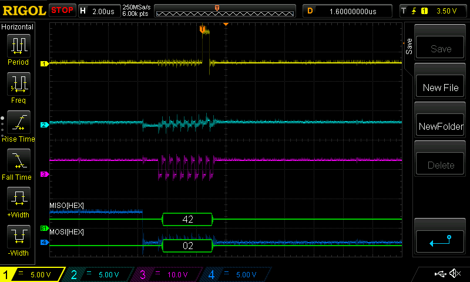
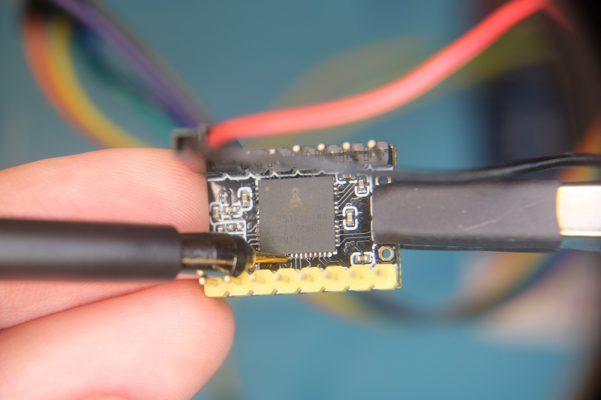

# TMC5160 debugging fun

## TL; DR;
Power the VM to make SPI work.

## Why TMC5160

I decided to use TMC as they advertise super silent execution with the patented technology ([StealthChop™](https://www.trinamic.com/technology/motor-control-technology/chopper-modes/)) and I want my child having a chance to sleep with the sounds of nature but not the stepper motor noise. Also, I don't want the stroller to sound like a muscle car driving our neighborhood :). I'll write another post about DC motors that I got from China.

Initially, I ordered TMC2209 to experiment with the NEMA motors. TMC2209 worked seamlessly through single-wire UART. Unfortunately, TMC2209 didn't have good luck, they have been burnt due to my stupidity: the first driver had been burnt when I changed VM voltage from 9 to 16 volts while the motor was running - the whole electronics got on fire and I had to calm down my wife that our house is not on fire; the second one was burnt when I swapped polarity for the VCC (supplied 5V to GND) (it was pretty late at night), something cracked and driver stop operating. Lessons learned - don't change conditions under the load, work only when you have a clear mind, and always use red/black wires for VCC/GND. I didn't have other drivers to work with, TMC2209 - RIP.

I work as a software engineer mostly dealing with the managed languages where you still can screw up things but you need to work hard to break things badly. Here I have burnt physical things and I was very upset. Electronics is just a hobby, I learn new things online, but mistakes are inevitable, so tears off and move on.

Motors mounts for the strollers were ready, I had to get new drivers. I decided to try out TMC5160 because I can run my NEMA 23 on full power and also it offers built-in ramp-up functionality ([SixPoint™](https://www.trinamic.com/technology/motion-control-technology/)) so I don't need to code it myself (even though I have already coded something for TMC2209).

When the driver arrived I was full of enthusiasm to continue testing. Changes to the sketch were minor, I wired everything up, left VM unpowered for sake of safety, uploaded the sketch - the driver didn't respond. I tried both software and hardware SPI - no response, I receive either all 0 or all 1 bits depends on the testing conditions. Checked [issues in TMCStepper repo](https://github.com/teemuatlut/TMCStepper/search?q=TMC5160&type=issues), read all threads but nothing helped. Then I tried to communicate over SPI without any libraries - the same result. The driver was not functioning correctly. Sad news again late in the evening but remembering what happened with 2209 decided to postpone experiments.

## Santa is coming

The next day I looked at the issue from another perspective - I wanted to have an oscilloscope but I didn't have any necessity, and here it is - my chance to get it for the reason :). Time was around Christmas so I told my wife that I know what I want as a present, she had no clue what oscilloscope is so I told her that I'll do everything myself and that will be her present to me, she was pretty happy with this proposal :). Next weekend I spent hours on choosing the present, it was amazing, like Christmas shopping in the mall, but not in the mall and not shopping. Finally, I ordered `Rigol DS1054z` ([EEVblog overview](https://www.youtube.com/watch?v=ETCOhzU1O5A)).

Software debugging is a pretty common thing. I didn't do hardware debugging before though and it was a nice experience, at least in the beginning. I connected probes to SPI headers to see what is transmitted between MCU and Driver.

`MOSI`, `SS` and `SCK` worked as expected, Rigol decoded it to what I sent - tried to read register with the address 2 (`IFCNT` which is disabled for SPI, but I wanted to get at least `SPI_STATUS` which is returned by the driver on any reads).

Channel 2 is `MISO`, I was happy that the driver returned the data. However, it had no sense - it correlates with SCK. I was surprised that Rigol decoded it to 42 what is [The Answer to the Ultimate Question of Life](https://en.wikipedia.org/wiki/42_(number)#The_Hitchhiker's_Guide_to_the_Galaxy). I got all 0s in the response on MCU though. The signal was very noisy and it was not intensive enough (~200mV, compare it to channel 1 for example).

The problem was still in `MISO` signal. Documentation didn't mention anything about logic level change, I tried to multiply it by several factors and that didn't help. 

Maybe the problem is not in the chip but the PCB? So I decided to verify the signal on the chip itself. It is pretty small, it was difficult to touch some chip pins with the probe, from the PCB pins side was not able to touch them at all:

I extended the probe with the jumper and it was pretty convenient to probe SPI and other pins:

After an hour I was pretty sure that everything is connected right - chip just output the noise for `MISO` channel :(. Sad thoughts about returning the product to the seller. Opened the comments and indeed some of them were about malfunctioning items. Crap.

## Hurray!

For the last time I decided to wire everything up with the motor power supply turned on (VM). And... signal was there!

I checked [datasheet for the driver](../../datasheets/TMC/TMC5160A_Datasheet_Rev1.14.pdf) and didn't find anything about requirements to power VM for operation. Perhaps this is a specific of [BIGREETECH PCB](../../datasheets/BIGTREETECH-TMC5160-V1.0/), I checked their documents and nothing mentioned there too. I was not able to find documentation for [v1.2](https://github.com/bigtreetech/BIGTREETECH-TMC5160-V1.0/issues/8) though. Is that normal at all :\ ?

Unfortunately, it was pure luck to make it work. On the other hand, I'm not blocked, I received a great present and I can continue building the project with these fancy Drivers. Lesson learned - test things with the prod like conditions.

It's still not clear why it does not work without VM power, if somebody knows, please create a ticket with the details and I'll update the post.
